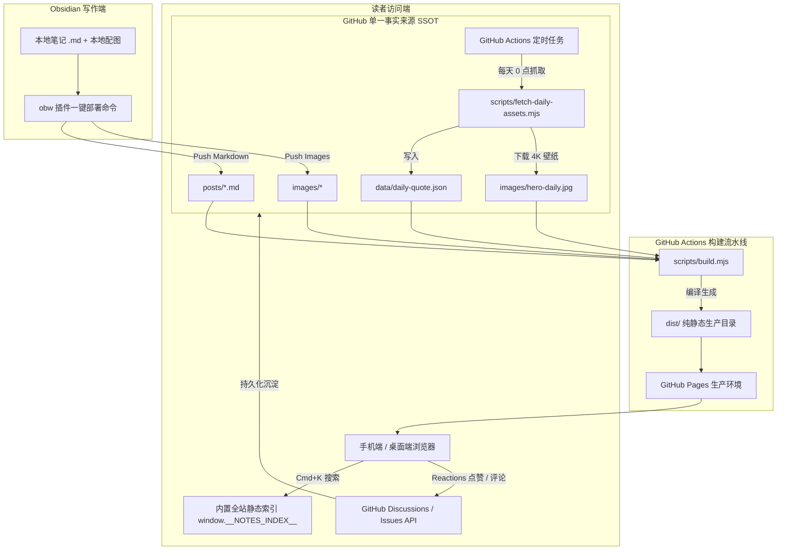

# Tan's Digital Garden (TAN) - V2 沉浸式视觉与极客交互系统设计规范

- **文档状态**：Validated / Approved for Implementation
- **创建日期**：2026-09-22
- **核心定位**：基于 Obsidian WeChat Publisher (obw) 核心排版引擎驱动的现代出版级极客数字花园，融合每日动态自然美学、微信官方移动端黄金排版、全站秒级全文检索与 GitHub Issues 原生互动闭环。

---

## 1. 核心目标与解决的关键问题

1. **暗黑模式白板彻底绝杀**：
   - 彻底清除 `:::cta`（持续交流探索）等微信排版模块中硬编码的 `#f7f8fa`、`#fafafa` 近白背景，深色模式下全部自动映射为 `var(--bg-card)` 与 `var(--bg-subtle)`。
2. **移动端（375px~430px）体验微信官方级对齐**：
   - 消除横向抖动与溢出（`overflow-x: hidden`），左右边距设定为黄金 `18px`，标题与正文字号、行高严格符合微信出版级规范（行高 `>= 1.75`）；
   - 顶部导航在小屏自动折叠冗余项，保持单行优雅不折叠；侧边栏目录转换为移动端轻量悬浮抽屉。
3. **品牌 Logo 重构为「TAN」**：
   - 放弃冗长的 "Tan's Blog"，升级为先锋几何品牌标 **TAN**，配极客副标 `// NOTES`。
4. **每日动态高清壁纸与渐变双层渲染**：
   - GitHub Actions 每日定时抓取 Bing 官方 4K UHD 自然风光壁纸（极光、星空、雪山、旷野）并做本地自建缓存；
   - CSS 分层渲染：`--theme-hero-gradient`（当前主题色氛围光）0ms 极速占位 + 高清实景大图渐显，断网离线依然色彩纯正。
5. **全站跨页面 Cmd+K 全局搜索与分类筛选修复**：
   - 生成全站静态索引 `window.__NOTES_INDEX__`，任意页面按下 Cmd+K / Ctrl+K 即可模糊搜索文章并支持键盘直达；
   - 修复分类药丸与标签筛选事件，支持平滑过渡与空状态容错。
6. **极客高留存互动矩阵（GitHub Issues 闭环）**：
   - 文章底部接入 GitHub 原生互动体系（Giscus / GitHub Issues 讨论），点赞与评论沉淀至 GitHub 仓库；
   - 增加专注阅读模式（Focus Mode）、代码块一键复制与智能相关文章推荐卡片。

---

## 2. 系统架构与数据流设计



---

## 3. 详细模块设计与技术契约

### 3.1 品牌 Logo 升级（TAN）
- **HTML 结构**：
  ```html
  <a href="index.html" class="site-brand">
    <span class="site-brand-icon">${ICONS.mountain}</span>
    <span class="brand-text">TAN</span>
    <span class="brand-badge">// NOTES</span>
  </a>
  ```
- **CSS 规范**：
  - `.brand-text`：`font-size: 1.35rem; font-weight: 850; letter-spacing: 0.08em; font-family: var(--font-sans);`
  - `.brand-badge`：`font-size: 0.72rem; font-family: var(--font-mono); color: var(--text-light); margin-left: 4px;`
  - 手机端（`max-width: 768px`）：`.brand-badge` 隐藏，保持单行极简。

### 3.2 微信公众号级移动端响应式排版
- **视口与容器锁定**：
  ```css
  html, body {
    overflow-x: hidden;
    width: 100%;
  }
  @media (max-width: 768px) {
    .article-wrapper {
      padding: 16px 0;
      grid-template-columns: 1fr;
    }
    .article-main {
      padding: 0 18px;
    }
    .article-title {
      font-size: 1.5rem !important;
      line-height: 1.45 !important;
      margin-bottom: 14px !important;
    }
    .article-content {
      font-size: 16.5px !important;
      line-height: 1.78 !important;
    }
    .article-content p {
      margin: 1.4em 0 !important;
    }
    .article-content pre {
      margin: 1.2em -18px !important;
      border-radius: 0 !important;
      padding: 14px 18px !important;
      overflow-x: auto;
    }
  }
  ```

### 3.3 彻底根除暗黑模式白板（含 `:::cta` 模块）
- **`adaptObwHtmlForWeb` 过滤规则扩展**：
  ```javascript
  // 匹配 #f7f8fa, #fafafa, #f5f5f7, #ffffff 等近纯白背景
  processed = processed.replace(
    /(?:background|background-color):\s*(?:#(?:ffffff|fff|fafafa|f8fafc|f7f8fa|f5f5f7|f3f4f6)|rgb\(\s*247\s*,\s*248\s*,\s*250\s*\)|rgb\(\s*255\s*,\s*255\s*,\s*255\s*\));?/gi,
    "background-color: var(--bg-card);"
  );
  ```
- **CSS 强力特异性覆盖**：
  ```css
  [data-mode="dark"] .wechat-module-cta,
  [data-mode="dark"] .wechat-module-cta span,
  [data-mode="dark"] .article-content [style*="background:#f7f8fa"],
  [data-mode="dark"] .article-content [style*="background: #f7f8fa"] {
    background-color: var(--bg-card) !important;
    background: var(--bg-card) !important;
    color: var(--text-main) !important;
    border-color: var(--border-color) !important;
  }
  ```

### 3.4 每日动态壁纸与双层自愈渲染
- **抓取脚本扩展**（`scripts/fetch-daily-assets.mjs`）：
  - 调用 `https://cn.bing.com/HPImageArchive.aspx?format=js&idx=0&n=1&mkt=zh-CN` 获取当日 4K 图片 URL 及故事标题；
  - 下载保存至 `images/hero-daily.jpg`，若获取失败平滑回退现有壁纸，永不阻断构建。
- **渲染分层栈**：
  ```css
  :root {
    --hero-bg: url('images/hero-daily.jpg'), url('images/hero-bg.jpg');
  }
  .home-hero-wrapper {
    background-color: var(--bg-page);
    background-image: var(--theme-hero-gradient), var(--hero-bg);
    background-size: cover;
    background-position: center top;
  }
  ```

### 3.5 全站全局 Cmd+K 搜索 & 筛选修复
- **静态全站索引**：在全局脚本注入 `window.__NOTES_INDEX__ = posts.map(p => ({ title, slug, desc, tags, categories, date, readingTime }))`。
- **全局搜索组件**：
  - 监听全局 `keydown`（Cmd+K / Ctrl+K / / 键唤起）；
  - 模糊检索标题、描述、标签、分类；
  - 键盘 `ArrowUp`、`ArrowDown` 选择，`Enter` 直达，`Escape` 退出。
- **分类与标签筛选联动**：
  - 选择器统一使用 `.card-item-2, .card-item-4`；
  - 点击文章标签时，自动触发分类药丸激活与卡片筛选。

### 3.6 GitHub Issues 互动闭环与极客功能
- **GitHub 互动集成**：
  - 文章页末尾嵌入 GitHub Discussions / Issues 驱动的互动区；
  - 提供 `[在 GitHub 讨论本篇]`、`[提出勘误]`、`[给本站 Star]` 三大极客徽章操作流。
- **专注阅读模式（Focus Mode）**：
  - 开启时为 `body` 添加 `.focus-reading-mode`，隐藏导航栏背景、底部横幅与非必要组件，正文居中沉浸铺展。
- **代码块一键复制**：
  - 自动检测所有 `<pre><code>` 节点，右上角挂载平滑渐隐的复制按钮，带拷贝成功动效。
- **相关文章智能推荐**：
  - 根据文章第一分类与标签交集算法匹配同类 2 篇文章，放置于文章结尾。

---

## 4. 自动化测试门禁与质量验收标准

在 `scripts/test-site.mjs` 中设置 7 大断言拦截：
1. **Logo 断言**：全站页面头部包含 `brand-text` 且文本为 `TAN`；
2. **白板免疫断言**：编译生成的 `dist/posts/*.html` 中绝对不包含 `background:#f7f8fa` 或任何未经变量化的纯白背景；
3. **全局搜索索引断言**：全站 HTML 均包含 `window.__NOTES_INDEX__` 数据结构且长度 >= 7；
4. **移动端响应式断言**：包含 `overflow-x: hidden` 与针对 `<pre>`、`.article-main` 的特定手机端媒体查询；
5. **动态壁纸回退断言**：`images/hero-daily.jpg` 存在且 CSS 中声明了 `--theme-hero-gradient` 复合背景；
6. **零死链断言**：全站静态扫描 0 个 404 死链；
7. **微信排版 0 div 断言**：所有文章 `article-content` 区块严格遵守 0 div 铁律。
